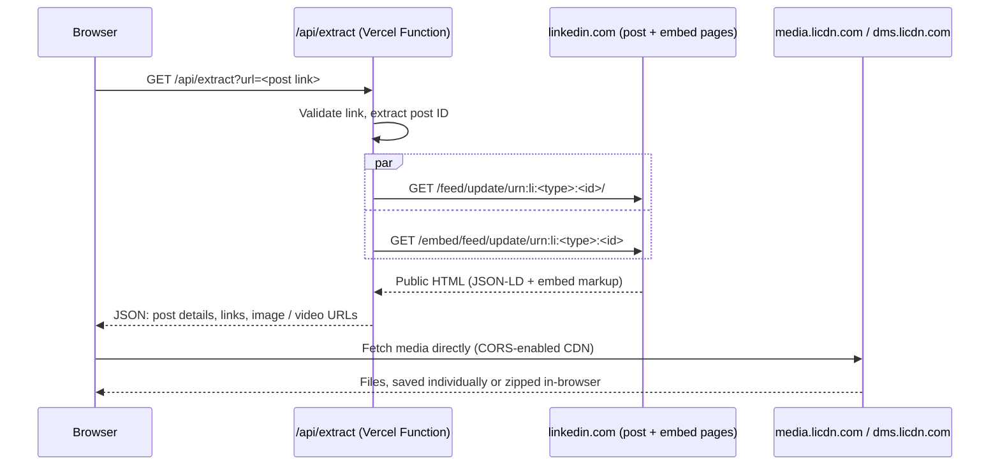

# LinkedIn Media Downloader

Paste a link to a public LinkedIn post and get every image and video in full quality — download them one at a time, or all at once as a single ZIP. No accounts, no tracking, nothing stored, no LinkedIn login needed.

[](https://vercel.com/new/clone?repository-url=https://github.com/Babug01/linkedin-media-downloader)

## Features

- **Paste and go.** Accepts every common post link format:
  - `https://www.linkedin.com/feed/update/urn:li:activity:<id>/`
  - `https://www.linkedin.com/posts/<author>_<slug>-activity-<id>-<hash>`
  - `share` and `ugcPost` URNs, encoded or plain, plus `m.linkedin.com` links
- **Every image, not just the first few.** Multi-image posts return the full set (e.g. all 12 of a 12-image carousel), each at the highest resolution LinkedIn serves. For videos, it selects the highest-quality MP4.
- **Download all as ZIP.** One click fetches every file in parallel (with a live progress bar) and saves a single `linkedin-<postId>-media.zip`, built entirely in your browser.
- **Post details.** Shows the author (with avatar and profile link), date, reaction and comment counts, and a *View on LinkedIn* link, plus the full post text with **Show more / Show less** to expand or collapse it. URLs and hashtags inside the text are clickable.
- **Links in this post.** Every outbound link in the post is listed with its domain and a copy button. `lnkd.in` short links are resolved to their real destination, and LinkedIn tracking parameters are removed.
- **Direct downloads.** Files download from LinkedIn's CDN straight into your browser, so large videos do not pass through the server.
- **Polished UI.** Animated aurora background, glass panels, skeleton loaders, staggered card animations, hover effects, a full-screen lightbox (arrow keys / Esc), toast notifications, and a mobile layout. Animations are disabled for users who prefer reduced motion.
- **Predictable file names**, e.g. `linkedin-<postId>-image-01.jpg`.
- **Private by design.** Uses no cookies, credentials, analytics, or database.
- **Lightweight.** Runs on plain HTML, CSS, and JavaScript with zero dependencies and no build step. The server side is one small Vercel Function.

## How it works



The post page's `SocialMediaPosting` JSON-LD lists **every** image in the post, while the embed page only renders the first five with a "+N" overlay. The function reads the JSON-LD, uses the embed page as a fallback and for video markup, and retries when LinkedIn occasionally serves a page with a partial image list. If images are still missing, the UI says so and the result is not cached.

The function is needed because browsers cannot read LinkedIn pages cross-origin. LinkedIn's media CDN does send `Access-Control-Allow-Origin: *`, so the browser downloads files — and builds the ZIP — itself. That keeps downloads outside Vercel's 4.5 MB function response limit.

## Security

- **No open proxy.** The function never fetches the URL you submit. It extracts the numeric post ID and fetches two fixed LinkedIn URLs rebuilt from that ID. To resolve short links it fetches only `https://lnkd.in/<code>` (code validated as 4–20 URL-safe characters, max 10 per post, 5-second timeout); it never fetches the destination site.
- **Safe rendering of post content.** Post text is inserted as plain text nodes, never parsed as HTML. Only `http(s)` links are rendered, always with `target="_blank"` and `rel="noopener noreferrer nofollow"`. Author, avatar, and post URLs are accepted only from LinkedIn hosts.
- **Strict host allowlists.** Post links must use HTTPS and `linkedin.com`. Returned media URLs are limited to `media.licdn.com` and `dms.licdn.com`.
- **Bounded upstream requests.** Requests time out after 10 seconds, do not follow redirects, and read at most 3 MB of HTML.
- **Hardened responses.** A strict Content Security Policy, `no-referrer` policy, and `nosniff` header apply everywhere. The UI renders content only through DOM APIs, never through `innerHTML`.

## Project structure

```
api/extract.js           Vercel Function: validates the link, fetches LinkedIn, returns media URLs
lib/linkedin.js          URL parsing, JSON-LD and HTML media extraction (pure functions)
public/index.html        Page markup
public/app.js            UI logic: results grid, lightbox, downloads, ZIP progress
public/zip.js            Dependency-free ZIP writer (STORE method, CRC-32)
public/styles.css        Styling and animations
test/                    Unit tests (node:test, no dependencies)
vercel.json              Security headers
```

## Run locally

Requirements: Node.js 20 or later.

```bash
git clone https://github.com/Babug01/linkedin-media-downloader.git
cd linkedin-media-downloader
npm test                 # run unit tests
npx vercel dev           # serve frontend and API at http://localhost:3000
```

## Deploy on Vercel (free)

1. Sign in at [vercel.com](https://vercel.com) with GitHub.
2. Open [vercel.com/new](https://vercel.com/new) and import `Babug01/linkedin-media-downloader`.
3. Keep the defaults: Framework Preset **Other**, no build command, and output directory `public`. Then click **Deploy**.

The app will be live at `https://<project-name>.vercel.app`. Future pushes to `main` redeploy automatically. The Vercel Hobby plan is free for personal, non-commercial use.

## Limitations

- **Public posts only.** Private, connections-only, and deleted posts return an error.
- **Supported media:** images and native video. Documents/carousels (PDF), articles, polls, and link previews are not supported.
- LinkedIn can change its page markup or rate-limit requests at any time, so extraction may break without notice. Occasionally LinkedIn returns only part of a post's image list; the app retries automatically and tells you if some images are still missing.
- The ZIP is built in browser memory, so posts with very large videos need enough free RAM.
- If the CDN refuses a cross-origin download, the file opens in a new tab so you can save it manually.

## Responsible use

Download only media you own or have permission to use. Public visibility does not grant reuse rights; respect creators' copyright and [LinkedIn's User Agreement](https://www.linkedin.com/legal/user-agreement). This project is not affiliated with or endorsed by LinkedIn.

## License

[MIT](LICENSE)
