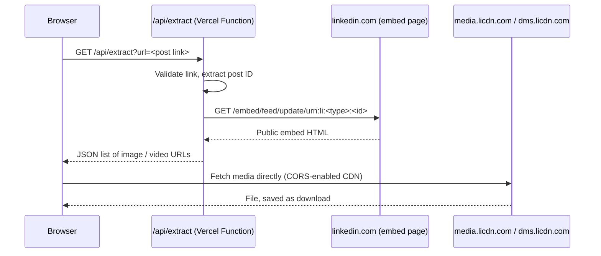

# LinkedIn Media Downloader

Paste a link to a public LinkedIn post, preview its images and videos, and download them in full quality. The app has no accounts, stores nothing, and requires no LinkedIn login.

[](https://vercel.com/new/clone?repository-url=https://github.com/Babug01/linkedin-media-downloader)

## Features

- **Paste and go.** Accepts every common post link format:
  - `https://www.linkedin.com/feed/update/urn:li:activity:<id>/`
  - `https://www.linkedin.com/posts/<author>_<slug>-activity-<id>-<hash>`
  - `share` and `ugcPost` URNs, encoded or plain, plus `m.linkedin.com` links
- **Images and videos.** Finds every image in a multi-image post and selects the highest-resolution version available. For videos, it selects the highest-quality MP4.
- **Direct downloads.** Files download from LinkedIn's CDN straight into your browser, so large videos do not pass through the server.
- **Download all.** Saves every media item with one click and gives each file a predictable name, e.g. `linkedin-<postId>-image-1.jpg`.
- **Private by design.** Uses no cookies, credentials, analytics, or database.
- **Lightweight.** Runs on plain HTML, CSS, and JavaScript without a framework or build step. The server side is one small Vercel Function.

## How it works



The function is needed because browsers cannot read LinkedIn pages cross-origin. LinkedIn's media CDN does send `Access-Control-Allow-Origin: *`, so the browser downloads files itself. That keeps downloads outside Vercel's 4.5 MB function response limit.

## Security

- **No open proxy.** The function never fetches the URL you submit. It extracts the numeric post ID and fetches the fixed LinkedIn embed URL rebuilt from that ID.
- **Strict host allowlists.** Post links must use HTTPS and `linkedin.com`. Returned media URLs are limited to `media.licdn.com` and `dms.licdn.com`.
- **Bounded upstream requests.** Requests time out after 10 seconds, do not follow redirects, and read at most 3 MB of HTML.
- **Hardened responses.** A strict Content Security Policy, `no-referrer` policy, and `nosniff` header apply everywhere. The UI renders content only through DOM APIs, never through `innerHTML`.

## Project structure

```
api/extract.js           Vercel Function: validates the link and returns media URLs
lib/linkedin.js          URL parsing and media extraction (pure functions)
public/                  Static frontend (index.html, app.js, styles.css)
test/linkedin.test.js    Unit tests (node:test, no dependencies)
vercel.json              Security headers
```

## Run locally

Requirements: Node.js 20 or later.

```bash
git clone https://github.com/Babug01/linkedin-media-downloader.git
cd linkedin-media-downloader
npm test                 # run unit tests
npx vercel dev           # serve frontend and API at http://localhost:3000
```

## Deploy on Vercel (free)

1. Sign in at [vercel.com](https://vercel.com) with GitHub.
2. Open [vercel.com/new](https://vercel.com/new) and import `Babug01/linkedin-media-downloader`.
3. Keep the defaults: Framework Preset **Other**, no build command, and output directory `public`. Then click **Deploy**.

The app will be live at `https://<project-name>.vercel.app`. Future pushes to `main` redeploy automatically. The Vercel Hobby plan is free for personal, non-commercial use.

## Limitations

- **Public posts only.** Private, connections-only, and deleted posts return an error.
- **Supported media:** images and native video. Documents/carousels (PDF), articles, polls, and link previews are not supported.
- LinkedIn can change its embed markup or rate-limit requests at any time, so extraction may break without notice.
- If the CDN refuses a cross-origin download, the file opens in a new tab so you can save it manually.

## Responsible use

Download only media you own or have permission to use. Public visibility does not grant reuse rights; respect creators' copyright and [LinkedIn's User Agreement](https://www.linkedin.com/legal/user-agreement). This project is not affiliated with or endorsed by LinkedIn.

## License

[MIT](LICENSE)
